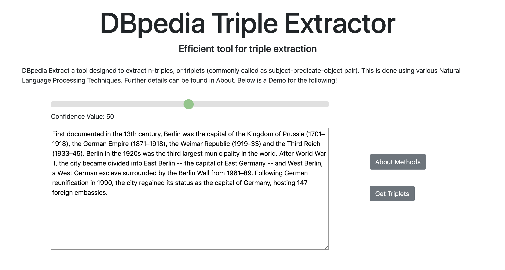

# Triple Extraction webapp 

This is the code of the web application DBpedia Extract created from the [base code](https://github.com/sahitpj/GSoC-codebase). This application extracts triples (subject, predicate, object) from plain text and can generate RDF from the triples. This project has been implemented under DBpedia supervision during the summer of 2019 funded by the [Google Summer of Code](https://summerofcode.withgoogle.com/dashboard/project/5162860156551168/overview/) program.

The webapp is running here: - `http://text2rdf.linkeddata.es` [link](http://text2rdf.linkeddata.es)

The user manual for the webapp can be found at the following [link](https://docs.google.com/document/d/1wjDltKVBqwjA3020mLj9TlBXviKq_f_n_Ga82tJJN6g/edit?usp=sharing)

Experiments, intermadiate results and other source code developed for the purpose of the application can be found [here](https://github.com/sahitpj/GSoC-codebase)

The application runs on `Flask`, uses `stanford coreNLP`, Google's `SyntaxNet` and `Spacy` for parsers and dependency parsers. The RDF generated by the application is in `turtle` format.
